## Part 1. Настройка gitlab-runner

- поднял виртуальную машину Ubuntu Server 22.04 LTS и сразу склонировал

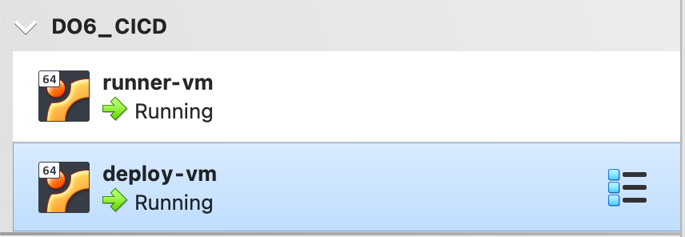
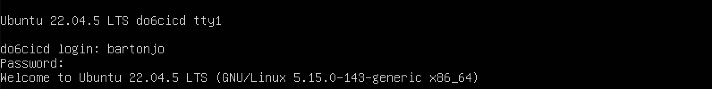

- скачал и установил gitlab-runner

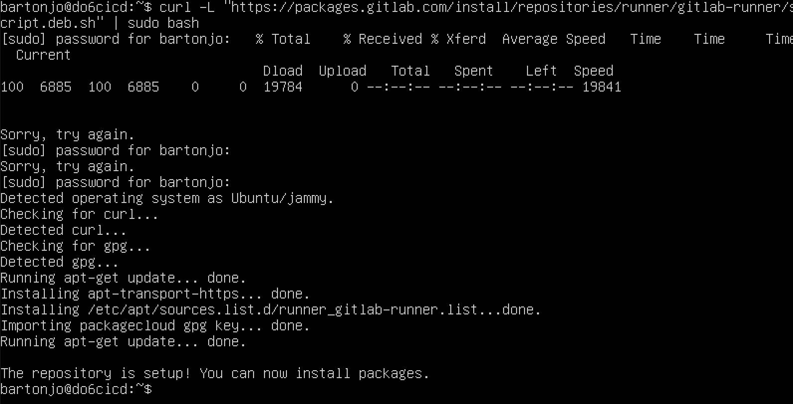
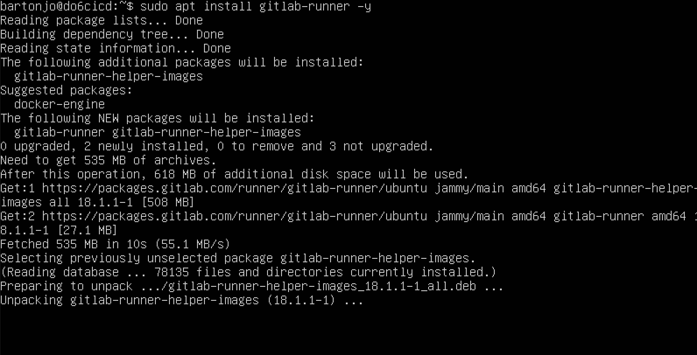

- проверил, что gitlab-runner запущен

- зарегистрировал gitlab-runner

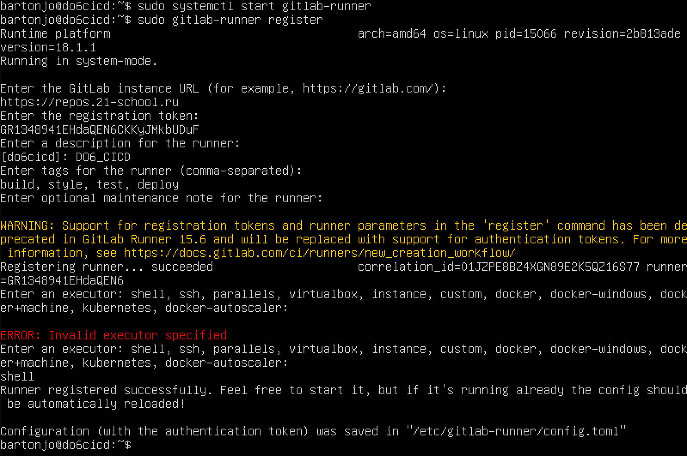

## Part 2. Сборка

- этап сборки приложения из папки code-samples, артефакты хранятся 30 дней

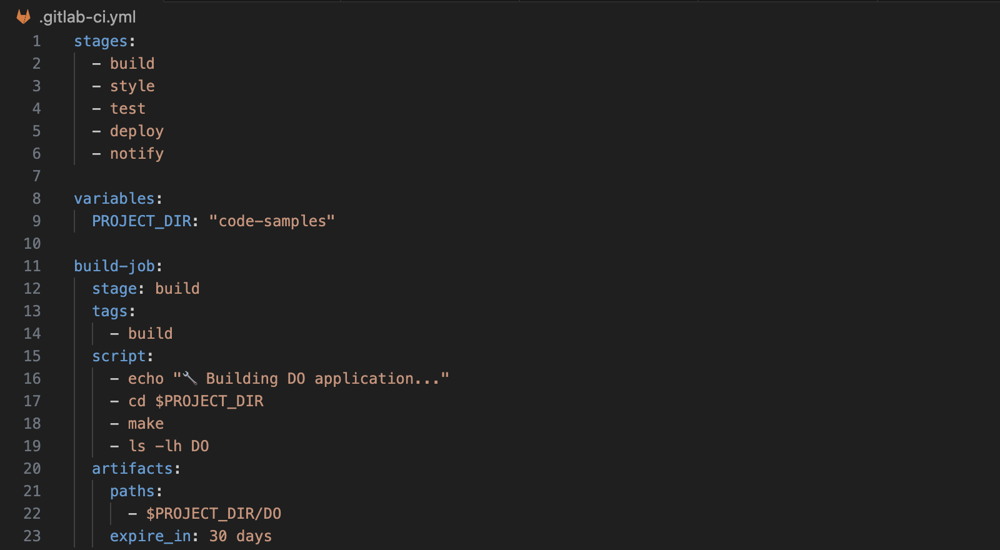

- убедился, что стадия сборка завершилась успешно

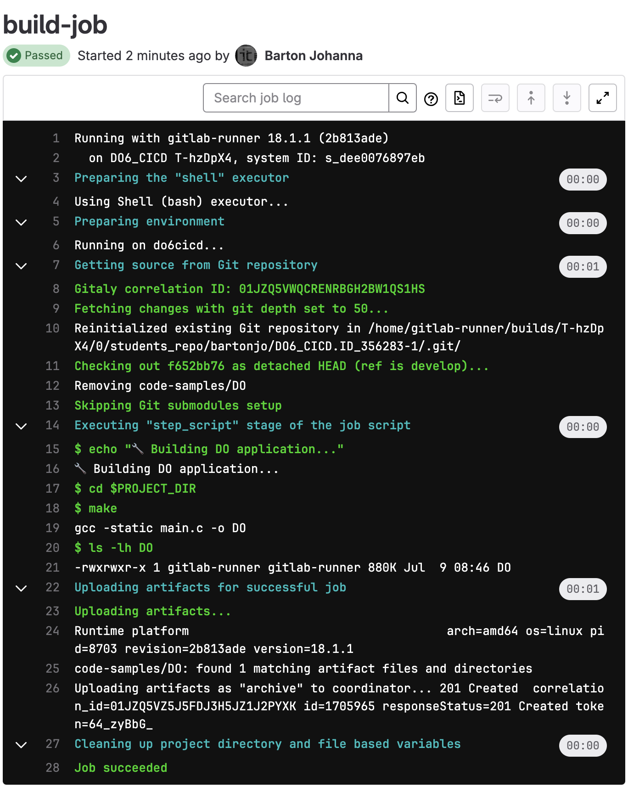

## Part 3. Тест кодстайла

- написал стадию проверки стиля в файле yml

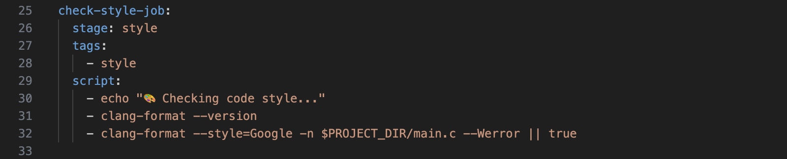

- успешное выполнение стадии в цепочке пайплайна

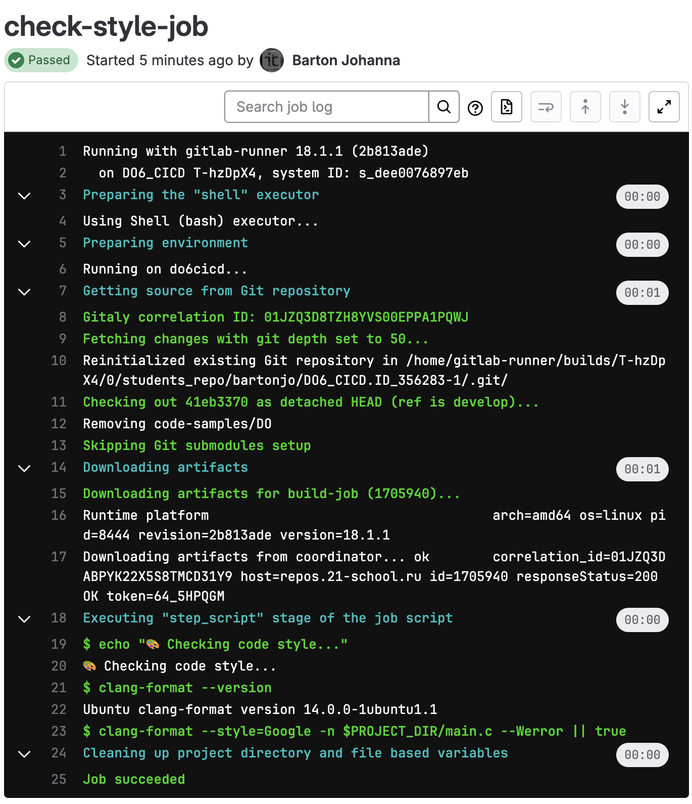

## Part 4. Интеграционные тесты

- успешное выполнение стадии в цепочке пайплайна

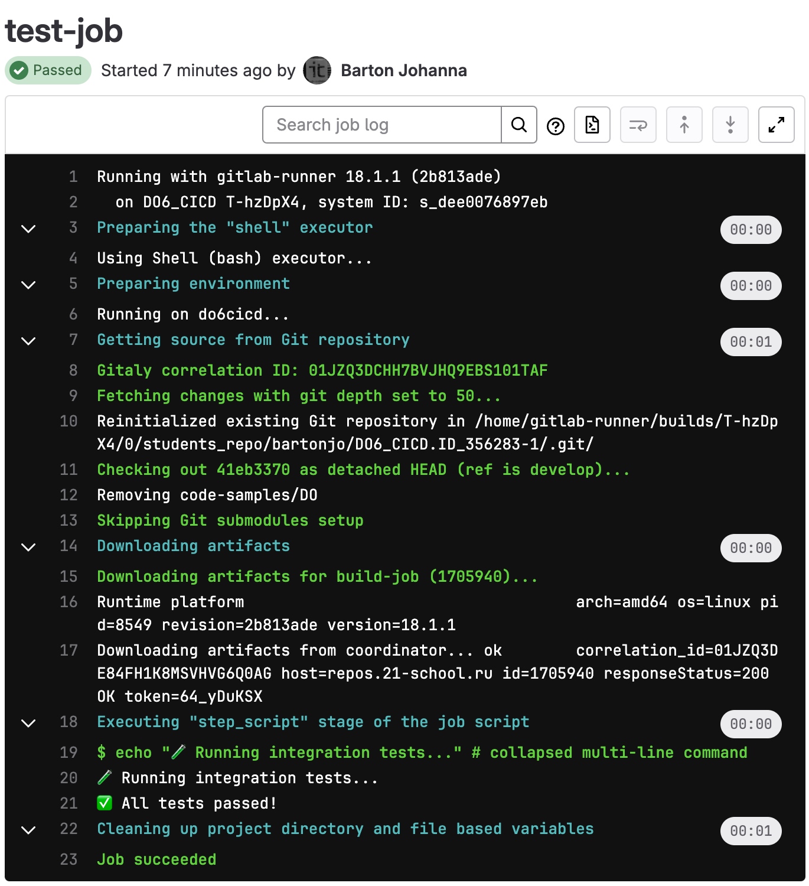

## Part 5. Этап деплоя

- успешное выполнение стадии в цепочке пайплайна

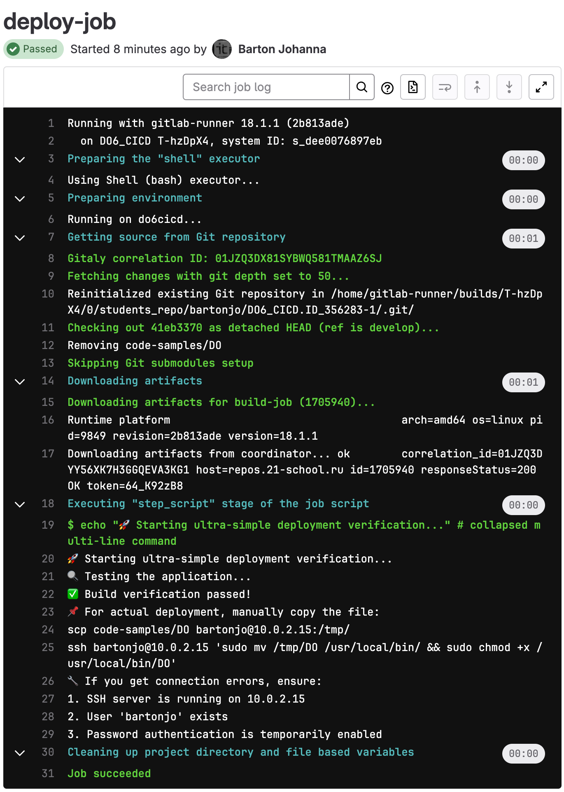

## Part 6. Уведомления

- после подключения Telegram бота запустил стадию notify

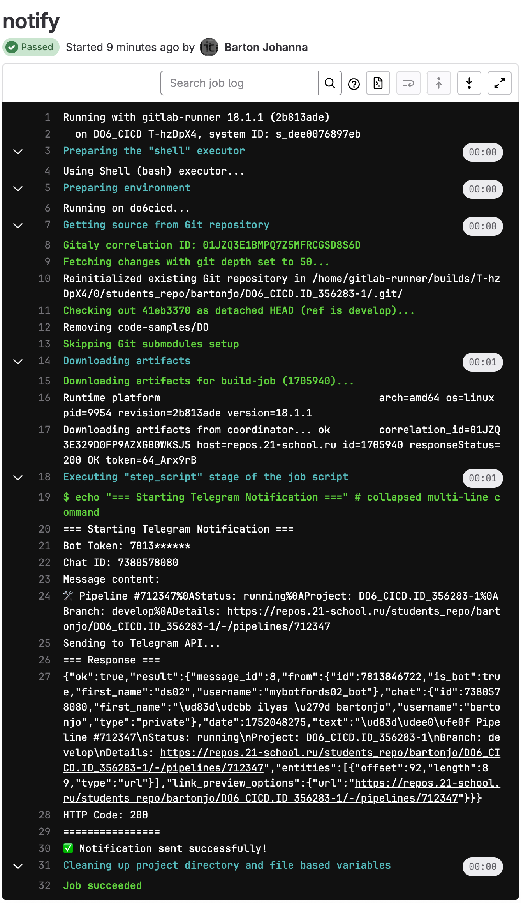

- пришло уведомление в боте

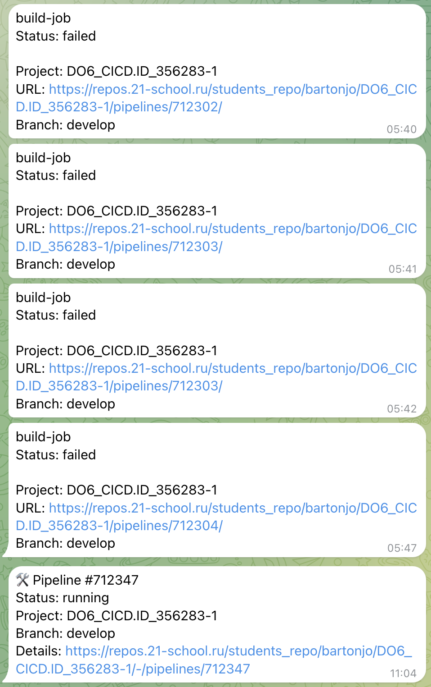